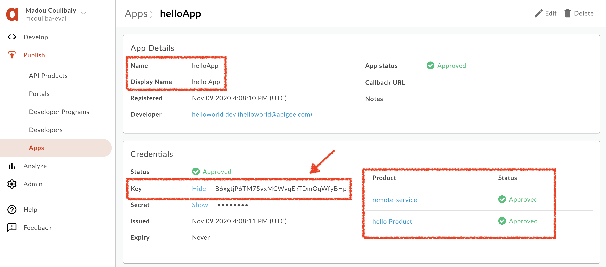

= Apigee Remote Service for OpenShift Service Mesh

This repository explains how to connect Apigee with OpenShift Service Mesh.

'''

== Prerequisites

Before you begin, you need

- Access to an OpenShift 4.x cluster with OpenShift Service Mesh 2.x installed
- `oc` installed
- Access to https://cloud.google.com/apigee/[Apigee Edge^]
- https://github.com/apigee/apigee-remote-service-cli/releases[`apigee-remote-service-cli`^] installed 
- curl cli installed

'''

== Provision Apigee Edge

First, you will use `apigee-remote-service-cli` to provision Apigee with remote services.
This command will create, install and deploy a `remote-service` with certificates and credentials the 
remote service will use to securely connect back to Apigee.

Execute the following command:

[source,bash]
----
apigee-remote-service-cli provision  \
    --organization <ORGANIZATION> \
    --environment <ENVIRONMENT> \
    --username <USERNAME> \
    --password <PASSWORD> \
    --legacy > remote-service-config.yaml
----

Check the `remote-service-config.yaml` generated file. It should look like to:

[source,yaml]
----
# Configuration for apigee-remote-service-envoy (platform: SaaS)
# generated by apigee-remote-service-cli provision on 2020-11-09 15:38:18
apiVersion: v1
kind: ConfigMap
metadata:
  name: apigee-remote-service-envoy
  namespace: apigee
data:
  config.yaml: |
    tenant:
      internal_api: https://istioservices.apigee.net/edgemicro
      remote_service_api: https://mcouliba-eval-test.apigee.net/remote-service
      org_name: mcouliba-eval
      env_name: test
      key: 86833897290acaabd60f2a19c302539dcec7e7e872b07eed6133d5b92f15e6e4
      secret: 6f53f070fa16246207fd5efb76a61c36bf892c1846dd0e302744c02a298e17e0

----

In Apigee, the `remote-service` api product has been created.

'''

=== Deploy a service to OpenShift

You will deploy a `hello-openshift` service on your OpenShift Cluster and enable Service Mesh.

First, login to your cluster.

[source,bash]
----
oc login
----

Create an `apigee-demo` project/namespace and add it as a Service Mesh Member.

[source,bash]
----
oc new-project apigee-demo
oc -n istio-system patch --type='json' smmr default -p '[{"op": "add", "path": "/spec/members", "value":["'"apigee-demo"'"]}]'
----

Then, deploy the `hello-openshift` application.

[source,bash]
----
oc apply -n apigee-demo -f hello-openshift.yaml
----

[IMPORTANT]
====
Please check that your service have 2 containers `oc get pods`: one for the application and the other for Istio Sidecar/proxy

[source,bash]
----
NAME                     READY   STATUS    RESTARTS   AGE
hello-65c7dbcdfd-hbfxc   2/2     Running   0          1m
----

====

You can test the new service using the following command:

[source,bash]
----
curl -i http://$(oc get routes -n apigee-demo hello --template={{.spec.host}})
----

The output should be like this:

[source,bash]
----
HTTP/1.1 200 OK
date: Mon, 09 Nov 2020 15:32:15 GMT
content-length: 17
content-type: text/plain; charset=utf-8
x-envoy-upstream-service-time: 0
server: istio-envoy
x-envoy-decorator-operation: hello.apigee-demo.svc.cluster.local:8080/*
set-cookie: a25407e57660ed3eb166be098de819db=d57e771d6d13485bc365b036bb72a1e1; path=/; HttpOnly
cache-control: private

Hello OpenShift!
----

'''

=== Deploy a Remote Service to OpenShift

The Remote Service provides the endpoints to the Istio sidecars that are installed on target services.

Deploy the Remote Service for Envoy:

[source,bash]
----
oc new-project apigee
oc adm policy -n apigee add-scc-to-user anyuid -z default
oc apply -n apigee -f remote-service-config.yaml
oc apply -n apigee -f apigee-envoy-adapter.yaml
----

Then, apply the EnvoyFilter in your `apigee-demo` project to redirect the traffic from your `hello-openshift` application 
to the `apigee-remote-service` service:

[source,bash]
----
oc apply -n apigee-demo -f envoyfilter-sidecar.yaml 
----

=== Test your Configuration

Access to your `hello-openshift` application.

[source,bash]
----
curl -i http://$(oc get routes -n apigee-demo hello --template={{.spec.host}})
----

You are now forbidden to access it:

[source,bash]
----
HTTP/1.1 403 Forbidden
date: Mon, 09 Nov 2020 15:56:18 GMT
server: istio-envoy
x-envoy-decorator-operation: hello.apigee-demo.svc.cluster.local:8080/*
content-length: 0
set-cookie: a25407e57660ed3eb166be098de819db=d57e771d6d13485bc365b036bb72a1e1; path=/; HttpOnly
----

Let's fix it!

In Apigee, create an API Product called `helloProduct` as following:

[IMPORTANT]
====
As Apigee Remote Service target, please enter the result of the `oc get routes -n apigee-demo hello --template={{.spec.host}}` 
command as 'Target Name'
====

Then, create an App called `helloApp` as following:

Under Credentials, click 'Show' next to the Key and copy the value. 
This value is the API key that you will use to make API calls to the `hello-openshift` service.

Now, try to access again to your `hello-openshift` application using the API key copied below.

[source,bash]
----
curl -i http://$(oc get routes -n apigee-demo hello --template={{.spec.host}}) -H "x-api-key: <APIKEY>"
----

The call should succeed with a 200 status and you should see the 'Hello OpenShift!' as a response:

[source,bash]
----
HTTP/1.1 200 OK
date: Mon, 09 Nov 2020 16:22:18 GMT
content-length: 17
content-type: text/plain; charset=utf-8
x-envoy-upstream-service-time: 0
server: istio-envoy
x-envoy-decorator-operation: hello.apigee-demo.svc.cluster.local:8080/*
set-cookie: a25407e57660ed3eb166be098de819db=d57e771d6d13485bc365b036bb72a1e1; path=/; HttpOnly
cache-control: private

Hello OpenShift!
----

This is the end of this demo.
I hope you enjoy it.